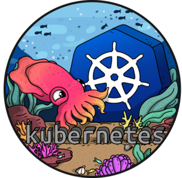

<h1 align="center">Kubernetes - minikube</h1>

<p align="center">
  

  

  

  

  <!--  -->

  <!--  -->

  <!--  -->
</p>

<div align="center" id="top"> 
  

  &#xa0;

  <!-- <a href="https://git.netlify.app">Demo</a> -->
</div>
<!-- Status -->

<h4 align="center"> 
	🚧  GIT 🚀 Under construction...  🚧
</h4> 

<hr>

<p align="center">
  <a href="#dart-about">About</a> &#xa0; | &#xa0; 
  <a href="#sparkles-features">Features</a> &#xa0; | &#xa0;
  <a href="#rocket-technologies">Technologies</a> &#xa0; | &#xa0;
  <a href="#white_check_mark-requirements">Requirements</a> &#xa0; | &#xa0;
  <a href="#checkered_flag-starting">Starting</a> &#xa0; | &#xa0;
  <a href="#memo-license">License</a> &#xa0; | &#xa0;
  <a href="https://github.com/aleksander124" target="_blank">Author</a>
</p>

<br>

## :dart: About ##

Small projcet for learing kubenretes commands and containerization with minikube. In this repository can be found some information about minikube instalation process and some usefull commands to develope your skills in containerization. I will be posting all the files about my kubernetes learning here.

## :sparkles: Features ##

:heavy_check_mark: Instalation minikube on your system;\
:heavy_check_mark: Create some deployments;\
:heavy_check_mark: Create first service and IP translation;\
:heavy_check_mark: Quick start some services in pods like nginx or mongo;

## :rocket: Technologies ##

The following tools were used in this project:

- [Minikube](https://minikube.sigs.k8s.io/)
- [Kubectl](https://kubernetes.io/)
- [Docker](https://www.docker.com/)
- [Nginx](https://www.nginx.com/)

## :white_check_mark: Requirements ##

Before starting :checkered_flag:, you need to have [Git](https://git-scm.com), [Minikube](https://minikube.sigs.k8s.io/docs/start/), [Kubectl](https://kubernetes.io/)   installed.

## :checkered_flag: Starting ##

```bash
# Clone this project
$ git clone https://github.com/aleksander124/git


```

## :memo: License ##

This project is under license from GNU. For more details, see the [LICENSE](LICENSE.md) file.


Made with :heart: by <a href="https://github.com/aleksander124" target="_blank">aleksander124</a>

&#xa0;

<a href="#top">Back to top</a>
